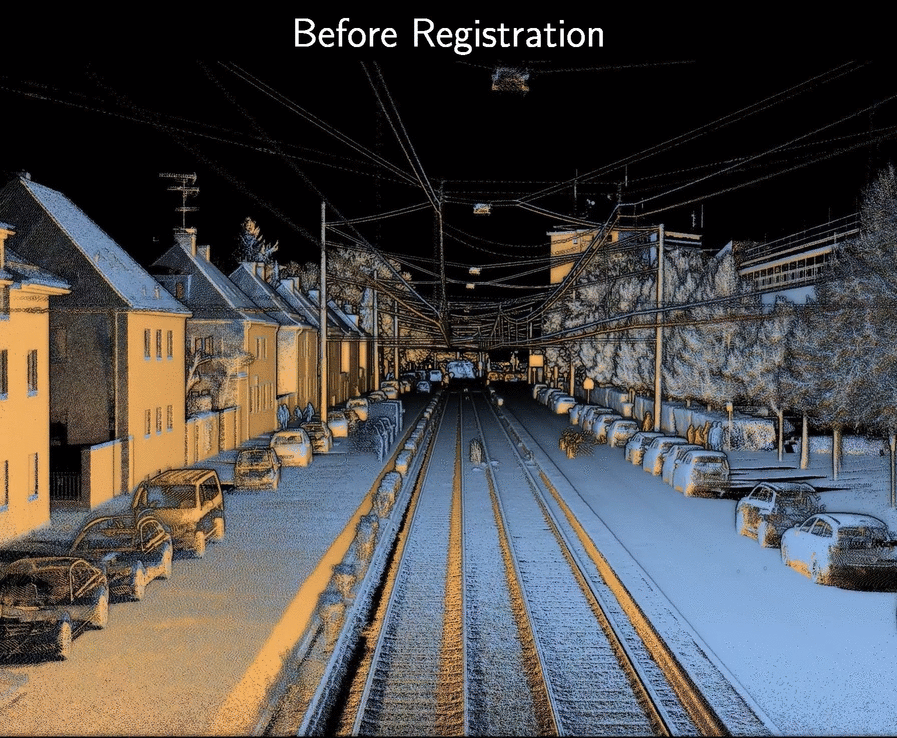
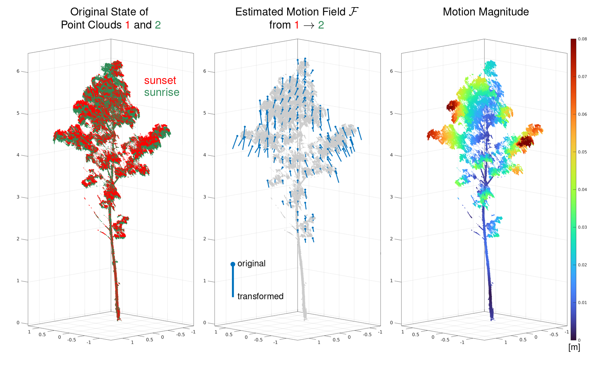

# 3D Non-Rigid Tricubic Point Cloud Registration

## Method

This is an implementation of the method described in the paper "**Non-rigid point cloud registration using piece-wise tricubic polynomials as transformation model**".

This method can be used to register two 3D point clouds which are related by a non-rigid transformation. In other words, when a 6DoF rigid-body transformation (rotation and translation) is insufficient to align the two point clouds, this method might be a suitable alternative.

## Examples

The following shows the non-rigid registration of two mobile mapping LiDAR point clouds in an urban environment:


(The effect of registration can best be seen on the overhead lines)

The method is quite flexible. In this example, it was used to estimate a tree’s motion field between sunset (red) and sunrise (green):

[](https://youtu.be/JNK9PtjtBlY?si=9gstIXi2sg1sHg7G)

Another example is the non-rigid registration of two mobile mapping LiDAR point clouds of a railway track (full video [here](https://youtu.be/HtRZxoqb4tc)):


## Paper

The paper can be found [here](https://www.mdpi.com/2072-4292/15/22/5348) - it can be cited as:

```
@article{glira2023a,
  article-number = {5348},
  author         = {Glira, Philipp and Weidinger, Christoph and Otepka-Schremmer, Johannes and Ressl, Camillo and Pfeifer, Norbert and Haberler-Weber, Michaela},
  doi            = {10.3390/rs15225348},
  issn           = {2072-4292},
  journal        = {Remote Sensing},
  number         = {22},
  title          = {Nonrigid Point Cloud Registration Using Piecewise Tricubic Polynomials as Transformation Model},
  url            = {https://www.mdpi.com/2072-4292/15/22/5348},
  volume         = {15},
  year           = {2023}
}
```

## 2D Prototype

A prototype implementation of this algorithm for 2D point clouds written in Matlab can be found [here](https://github.com/AIT-Assistive-Autonomous-Systems/2D_nonrigid_tricubic_pointcloud_registration).

## Building

A predefined development environment for [VSCode](https://code.visualstudio.com) is provided [here](.devcontainer/). To use this environment, simply open this repository in VSCode and:
1. Open the devcontainer with the command ``Dev Containers: Reopen in Container``. This will automatically build the development environment and open it. Then run in the container:
    1. The command ``CMake: Select a Kit`` to select a compiler.
    2. The command ``CMake: Select Variant`` to select a the ``Release`` build type.
	  3. The command ``CMake: Build`` to build all targets.
    4. The command ``CMake: Run tests`` to run the tests.
2. You can find the two executables in the ``bin`` directory:
    - ``nonrigid-icp`` is used to estimate the non-rigid transformation between two point clouds.
    - ``nonrigid-icp-transform`` is used to apply the estimated transformation to a point cloud.

## Star History

[](https://www.star-history.com/#AIT-Assistive-Autonomous``-Systems/3D_nonrigid_tricubic_pointcloud_registration&Date)``