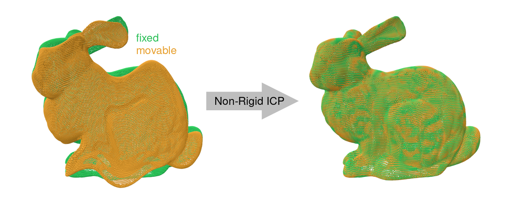

# 3D Non-Rigid ICP

[](https://github.com/AIT-Assistive-Autonomous-Systems/3D_nonrigid_ICP/actions/workflows/build-windows.yml)
[](https://github.com/AIT-Assistive-Autonomous-Systems/3D_nonrigid_ICP/actions/workflows/build-linux.yml)
[](https://github.com/AIT-Assistive-Autonomous-Systems/3D_nonrigid_ICP/releases)
[](LICENSE)
[](https://doi.org/10.3390/rs15225348)



TLDR: see [the tutorial](docs/tutorial/README.md) for a step-by-step guide on how to use the non-rigid ICP algorithm.

## Method

This is an implementation of the method described in the [paper](https://www.mdpi.com/2072-4292/15/22/5348) "**Non-rigid point cloud registration using piece-wise tricubic polynomials as transformation model**".

This method can be used to register two 3D point clouds which are related by a non-rigid transformation. In other words, when a 6 degree-of-freedom rigid-body transformation (3 translation + 3 rotations) is insufficient to align the two point clouds, this method might be a suitable alternative.

## Examples

The following shows the non-rigid registration of two mobile mapping LiDAR point clouds in an urban environment:


(The effect of registration can best be seen on the overhead lines)

The method is quite flexible. In this example, it was used to estimate a tree’s motion field between sunset (red) and sunrise (green):

[](https://youtu.be/JNK9PtjtBlY?si=9gstIXi2sg1sHg7G)

Another example is the non-rigid registration of two mobile mapping LiDAR point clouds of a railway track (full video [here](https://youtu.be/HtRZxoqb4tc)):


## Executables

Two command line executables are provided:
- `nonrigid-icp`: Estimates the non-rigid transformation between two point clouds
- `nonrigid-icp-transform`: Applies the estimated non-rigid transformation to a point cloud

Builds are provided for Linux and Windows, see [Releases](https://github.com/AIT-Assistive-Autonomous-Systems/3D_nonrigid_ICP/releases).

These are the help messages of the two executables:

**nonrigid-icp --help**:

```txt
Grid based point cloud matching.
Usage:
  nonrigid-icp [OPTION...]

  -f, --fixed arg               Path to fixed point cloud
  -m, --movable arg             Path to movable point cloud
  -t, --transform arg           Path to generated transform file. This file
                                contains the estimated translation grids
                                for the movable point cloud. The executable
                                "nonrigid-icp-transform" can be used to
                                transform a point cloud with this transform
                                file.
  -v, --voxel_size arg          Voxel size of translation grids (default:
                                1)
  -g, --grid_limits arg         Limits of translation grids to be defined
                                as "x_min,y_min,z_min,x_max,y_max,z_max".
                                Note that the extent of the grids in x,y,z
                                must be an integer multiple of the voxel
                                size. The grid limits are chosen
                                automatically by passing "0,0,0,0,0,0".
                                (default: 0,0,0,0,0,0)
  -b, --buffer_voxels arg       Number of voxels to be used as buffer
                                around the translation grids (default: 2)
  -a, --matching_mode arg       Matching mode for correspondences.
                                Available modes are "nn" (nearest neighbor)
                                and "id" (correspondence_id). (default: nn)
  -n, --num_correspondences arg
                                Number of correspondences (default: 10000)
  -e, --max_euclidean_distance arg
                                Maximum euclidean distance between
                                corresponding points (default: 1)
  -i, --num_iterations arg      Number of iterations (default: 5)
  -w, --weights arg             Weights of zero observations as list for
                                "f,fx/fy/fz,fxy/fxz/fyz,fxyz" (default:
                                1,1,1,1)
  -d, --debug_dir arg           Directory for debug output for
                                correspondences. (default: "")
  -s, --suppress_logging        Suppress log output
  -p, --profiling               Enable runtime profiling output (timing
                                summary)
  -h, --help                    Print usage
```

**nonrigid-icp-transform --help**:

```txt
Transformation of point cloud using transform file generated by the executable "nonrigid-icp"
Usage:
  nonrigid-icp-transform [OPTION...]

  -i, --pc_in arg         Path to input point cloud
  -o, --pc_out arg        Path to output point cloud, i.e. transformed
                          point cloud
  -t, --transform arg     Path to transform file generated by the
                          executable "nonrigid-icp"
  -c, --chunk_size arg    Number of points per chunk used for transforming
                          the input point cloud (default: 1000000)
  -s, --suppress_logging  Suppress log output
  -p, --profiling         Enable runtime profiling output (timing summary)
  -h, --help              Print usage
```

## Paper

The paper can be found at [https://www.mdpi.com/2072-4292/15/22/5348](https://www.mdpi.com/2072-4292/15/22/5348) - please cite it if you use this code:

```bibtex
@article{glira2023a,
  article-number = {5348},
  author         = {Glira, Philipp and Weidinger, Christoph and Otepka-Schremmer, Johannes and Ressl, Camillo and Pfeifer, Norbert and Haberler-Weber, Michaela},
  doi            = {10.3390/rs15225348},
  issn           = {2072-4292},
  journal        = {Remote Sensing},
  number         = {22},
  title          = {Nonrigid Point Cloud Registration Using Piecewise Tricubic Polynomials as Transformation Model},
  url            = {https://www.mdpi.com/2072-4292/15/22/5348},
  volume         = {15},
  year           = {2023}
}
```

## 2D Prototype

A prototype implementation of this algorithm for 2D point clouds written in Matlab can be found [here](https://github.com/AIT-Assistive-Autonomous-Systems/2D_nonrigid_ICP).

## Build

### Building on Linux

A ready-to-use development environment for [VSCode](https://code.visualstudio.com) is available in the [.devcontainer/](.devcontainer/) folder. To get started, clone this repository (use LFS if you plan to run the tests), open it in VSCode, and follow these steps:
1. Open the devcontainer with the command ``Dev Containers: Reopen in Container``. This will automatically build the development environment and open it. Then run in the container:
    1. The command ``CMake: Select a Kit`` to select a compiler.
    2. The command ``CMake: Select Variant`` to select a the ``Release`` build type.
	  3. The command ``CMake: Build`` to build all targets.
    4. The command ``CMake: Run tests`` to run the tests.
2. You can find the two executables in the ``bin`` directory:
    - ``nonrigid-icp`` is used to estimate the non-rigid transformation between two point clouds.
    - ``nonrigid-icp-transform`` is used to apply the estimated transformation to a point cloud.

### Building on Windows

Look into the [.github/workflows/build-windows.yml](.github/workflows/build-windows.yml) file for instructions on how to build the project on Windows using CMake and Visual Studio.

## Star History

[](https://www.star-history.com/#AIT-Assistive-Autonomous``-Systems/3D_nonrigid_ICP&Date)``
