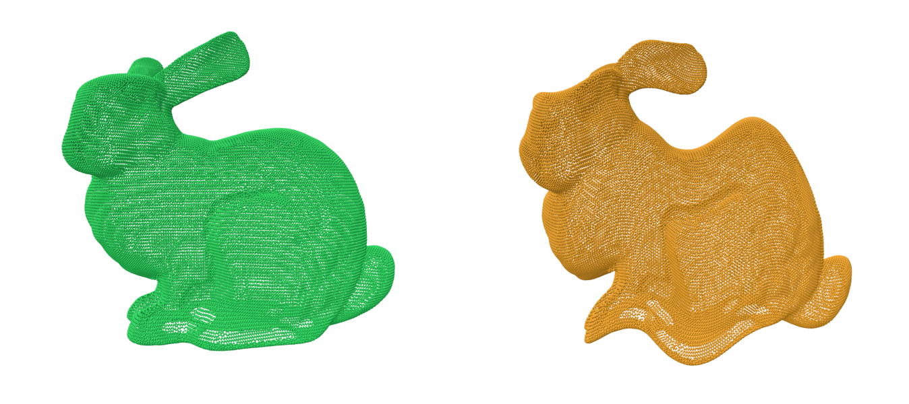
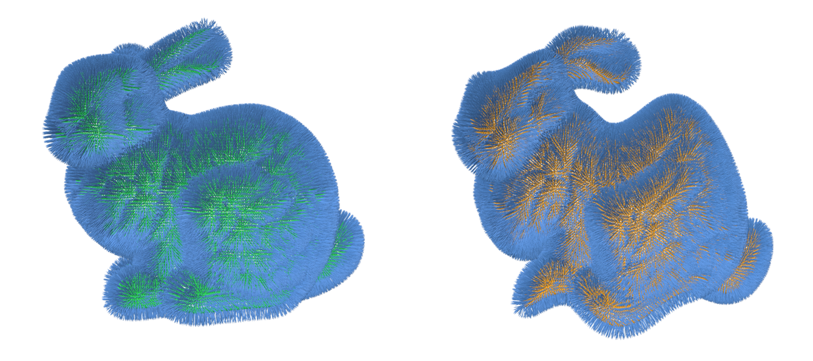
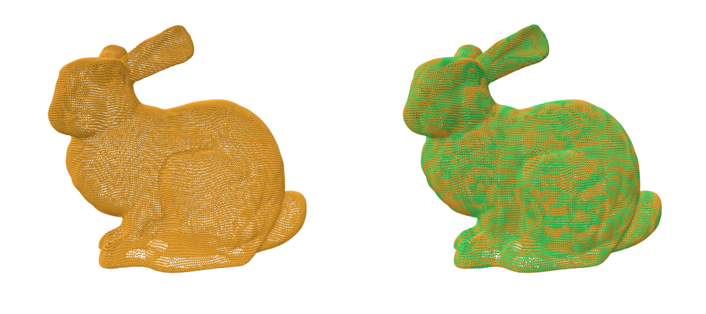

# Tutorial

This tutorial demonstrates how to register two point clouds using the non-rigid ICP algorithm.

## Prerequisites

You will need:

- Two executables: `nonrigid-icp` and `nonrigid-icp-transform` available from the [Releases](https://github.com/AIT-Assistive-Autonomous-Systems/3D_nonrigid_tricubic_pointcloud_registration/releases).
  - For Linux: use `nonrigid-icp-x86_64.AppImage` and `nonrigid-icp-transform-x86_64.AppImage`
  - For Windows: use `nonrigid-icp.exe` and `nonrigid-icp-transform.exe`
- Sample point clouds: `original-bunny.ply` ([source](https://graphics.stanford.edu/data/3Dscanrep/)) and `deformed-bunny.ply` from the [tutorial folder](./).



It can clearly be seen that these two point clouds can not be aligned using a simple 6 degrees-of-freedom (3 translations + 3 rotations) rigid-body transformation.

## Normal Vectors Requirement

The non-rigid ICP algorithm uses the point-to-plane error metric. Thus, it requires normal vectors in both input point clouds:

- For PLY files: normals must be stored as vertex properties `normalx`, `normaly`, `normalz` or `nx`, `ny`, `nz`.
- For LAS/LAZ files: normals must be stored as extra dimensions `NormalX`, `NormalY`, `NormalZ`



You can compute normals using tools like [CloudCompare](https://www.danielgm.net/cc/), [MeshLab](https://www.meshlab.net/), or [PDAL](https://pdal.io/).

See [this PDAL pipeline example](../../test/test-mls-rail/pdal-pipeline.json) for filtering point clouds and computing normals.

## Computing the Non-Rigid Transformation

Use `nonrigid-icp` to estimate the transformation between the two point clouds:

```bash
nonrigid-icp-x86_64.AppImage \
    --fixed original-bunny.ply \
    --movable deformed-bunny.ply \
    --voxel_size 2 \
    --max_euclidean_distance 2.0 \
    --matching_mode nn \
    --num_iterations 10 \
    --weights 0.1,0.1,0.1,0.1 \
    --transform transform-grid-nn.nricp
```

Run `nonrigid-icp --help` for parameter descriptions, or see the [paper](https://www.mdpi.com/2072-4292/15/22/5348) for detailed information.

This command generates `transform-grid-nn.nricp` containing the estimated translation grids.

## Applying the Transformation

Now, apply the computed transformation using `nonrigid-icp-transform`:

```bash
nonrigid-icp-transform-x86_64.AppImage \
    --pc_in deformed-bunny.ply \
    --pc_out aligned-bunny-nn.ply \
    --transform transform-grid-nn.nricp
```


(Left: `aligned-bunny-nn.ply`. Right: `aligned-bunny-nn.ply` with `original-bunny.ply`)

As shown, the point clouds are now reasonably well aligned. However, the registration is not perfect due to correspondences being established through a simple nearest neighbor search (`--matching_mode nn`). While this approach works well for large-scale point clouds (e.g., mobile or aerial laser scanning data), it can produce some incorrect correspondences for our bunny model.

However, the input PLY files contain the attribute `CorrespondenceID`, which provides better correspondence information. This can be leveraged by using `--matching_mode id` instead. With this improved correspondence matching, the deformation can be corrected more accurately:

```bash
nonrigid-icp-x86_64.AppImage \
    --fixed original-bunny.ply \
    --movable deformed-bunny.ply \
    --voxel_size 2 \
    --max_euclidean_distance 2.0 \
    --matching_mode id \
    --num_iterations 10 \
    --weights 0.1,0.1,0.1,0.1 \
    --transform transform-grid-id.nricp

nonrigid-icp-transform-x86_64.AppImage \
    --pc_in deformed-bunny.ply \
    --pc_out aligned-bunny-id.ply \
    --transform transform-grid-id.nricp
```


(Left: `aligned-bunny-id.ply`. Right: `aligned-bunny-id.ply` with `original-bunny.ply`)

## Issues?

Feel free to open an [issue](https://github.com/AIT-Assistive-Autonomous-Systems/3D_nonrigid_tricubic_pointcloud_registration/issues) if you encounter any problems.

## Additional Examples

Find more examples in the [test folder](test/).